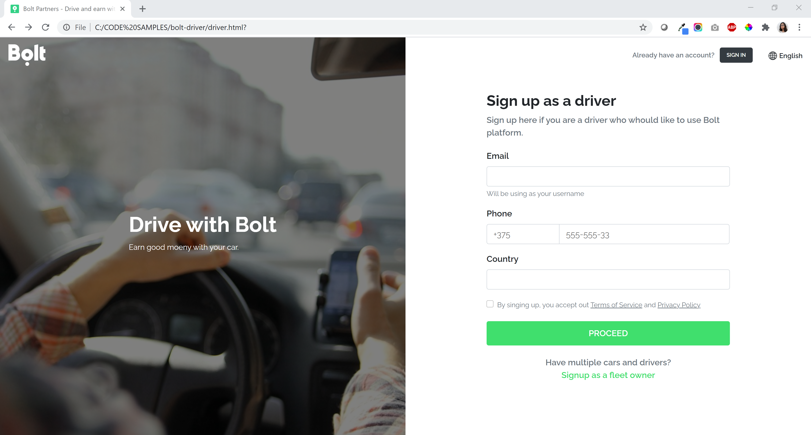
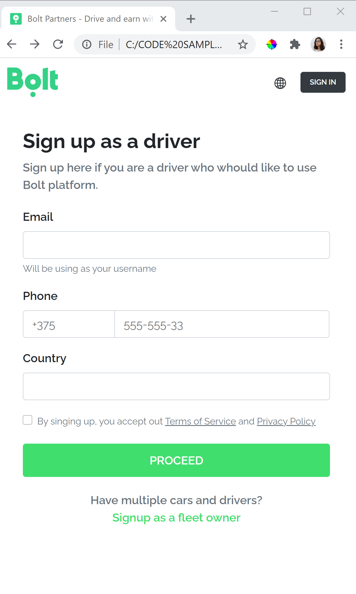

# Bolt - Driver

This is a web page created to let drivers Signup as Bolt drivers. 

## Made with:

* Bootstrap 4.5.3
* HTML
* CSS
* Basic Javascript for validations

## Side notes:
* All links are functional, except language.
* I changed "Taxify" references to "Bolt", cause my understanding is that "Taxify" is now called "Bolt".
* Added seo tags: Social - Title - Description
* Added favico
* Fonts are beign loaded from google fonts CDN. i am using raleway cause I think is the font used on the image reference provided.
* Bootstrap is beign loaded from CDN

Output for Desktop:

Output for Mobile:

